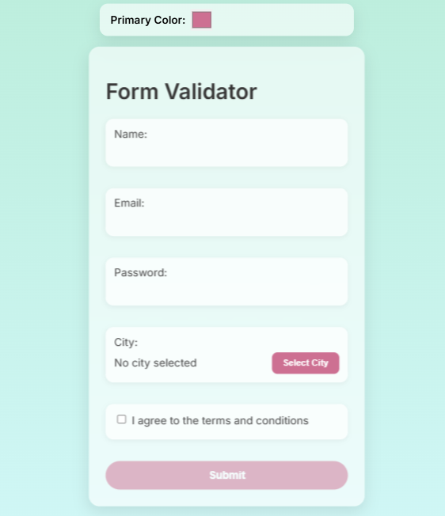

# Catalog-Week-2-Assignmnet | Garden-Form-Validator



A fully customizable React and TypeScript form validator with features such as:

- **Form Validation** for name, email, and password (with a strength meter)
- **City Selection Modal** with searchable and debounced input for choosing an Indian city
- **Theme Customization** via CSS custom properties and a settings panel (color picker)
- **Post-Submission Success Animation** that first displays a spinning flower and then transitions to a success checkmark overlay
- **Modern Git Hooks** integration using Husky 

This package is designed to be both developer‑friendly and end‑user customizable while maintaining a sleek glass/frosted appearance.

---

## Table of Contents

- [Installation](#installation)
- [Usage](#usage)
  - [Importing and Rendering the Form](#importing-and-rendering-the-form)
  - [Customizing the Theme](#customizing-the-theme)
  - [City Modal & Search](#city-modal--search)
  - [Password Strength Meter](#password-strength-meter)
  - [Post-Submission Animation](#post-submission-animation)
- [API / Components](#api--components)
  - [ThemeSettings](#themesettings)
  - [CityModal](#citymodal)
  - [FlowerCheckOverlay / SuccessOverlay](#flowercheckoverlay--successoverlay)
- [Customization & Styling](#customization--styling)
- [Development & Contributing](#development--contributing)
- [License](#license)

---

## Installation

1. **Clone the Repository**

   ```bash
   git clone https://github.com/jaibhedia/catalog-week2-assignment
   cd form
   ```

2. **Install Dependencies**

   Using npm:

   ```bash
   npm install
   ```

   Or using Yarn:

   ```bash
   yarn install
   ```

3. **Build the Package (if needed)**

   The package is written in TypeScript, so you might need to compile it before publishing or using:

   ```bash
   npm run build
   ```

---

## Usage

### Importing and Rendering the Form

After installing, you can import the main form component into your React app as follows:

```tsx
import React from "react";
import { createRoot } from "react-dom/client";
import App from "react-ts-form-validator"; // if published on npm
import "react-ts-form-validator/dist/index.css"; // optional, if you publish compiled CSS

const container = document.getElementById("root");
const root = createRoot(container!);
root.render(<App />);
```

If you are using it locally from your repository, ensure your entry point (e.g., `src/index.tsx`) includes the full form code and styles.

### Customizing the Theme

This package uses CSS custom properties for theming. A `ThemeSettings` component provides a color picker that lets users change the primary color dynamically. In the rendered UI, the color picker appears at the top:

```tsx
<ThemeSettings />
```

Changing the color picker updates the `--primary-color` CSS variable, which affects elements like the submit button and other accents.

### City Modal & Search

- **CityModal:**  
  When the user clicks "Select City," a modal appears with a searchable list of Indian cities.  
- **Search Input:**  
  The search field uses a debouncing mechanism so that filtering occurs only after the user pauses typing.

### Password Strength Meter

- The password input includes a live strength meter.
- The meter computes a score (0–100) based on password length, use of uppercase, lowercase, and special characters.
- It displays a progress bar whose width and color (red, yellow, green) vary with the strength, along with a label (Weak, Medium, Strong).

### Post-Submission Animation

After successful submission:
1. The form resets and a custom overlay is displayed.
2. The overlay first shows a **spinning flower emoji** for 1 second.
3. Then, it transitions to a **checkmark** with the message "Form Submitted Successfully!" for 2 seconds.
4. The overlay automatically disappears after 3 seconds, or the user can dismiss it by clicking.

---

## API / Components

### ThemeSettings

**Description:**  
A simple component that displays a color picker for modifying the primary theme color.

**Usage:**

```tsx
import ThemeSettings from "./ThemeSettings";

// Render at the top of your app
<ThemeSettings />
```

### CityModal

**Description:**  
A modal component for selecting an Indian city. It includes:
- A search bar with debouncing (via a custom hook).
- A filtered list of cities.
- A "Cancel" button to close the modal.

**Props:**

- `isOpen: boolean` – Whether the modal is visible.
- `onClose: () => void` – Callback to close the modal.
- `onSelect: (city: string) => void` – Callback when a city is selected.

**Usage Example:**

```tsx
<CityModal
  isOpen={cityModalOpen}
  onClose={() => setCityModalOpen(false)}
  onSelect={(city) => setFormData({ ...formData, city })}
/>
```

### FlowerCheckOverlay / SuccessOverlay

**Description:**  
An overlay that provides a two-phase animation after form submission:
- **Phase 1:** Displays a spinning flower emoji for 1 second.
- **Phase 2:** Transitions to a green checkmark with a success message for 2 seconds.

**Props:**

- `onClose: () => void` – Callback to close the overlay.

**Usage Example:**

```tsx
{showMagic && <FlowerCheckOverlay onClose={() => setShowMagic(false)} />}
```

---

## Customization & Styling

All styles are driven by CSS custom properties defined in the `:root` selector in **index.css**:

```css
:root {
  --primary-color: #cd7092;
  --background-color: rgba(255, 255, 255, 0.6);
  --input-bg: rgba(255, 255, 255, 0.7);
  --input-border-color: rgba(255, 255, 255, 0.3);
  --input-text-color: #444;
  --error-color: #e63946;
  --border-radius: 12px;
  --container-border-radius: 16px;
  --box-shadow: 0 8px 24px rgba(0, 0, 0, 0.1);
}
```

You can modify these values directly or use the provided ThemeSettings component to change them dynamically.

---

## Development & Contributing

- **Local Development:**  
  Run your project locally with your preferred dev server (e.g., `npm start` if using Create React App or your custom Webpack setup).
  
- **Linting and Testing:**  
  Ensure you have proper scripts set up (e.g., ESLint, Jest) to maintain code quality. Consider integrating Husky for pre-commit hooks.
  
- **Contributing:**  
  Contributions are welcome! Please open an issue or submit a pull request for improvements, bug fixes, or new features.

- **Building:**  
  To compile the TypeScript code to JavaScript, run:
  
  ```bash
  npm run build
  ```
  
  This will create a `dist/` folder with the compiled files.

---

## License

This project is licensed under the MIT License. See the [LICENSE](LICENSE) file for details.

---

## Summary

The **React TS Form Validator** package is a feature-rich, customizable form solution that combines robust form validation, dynamic theming, an interactive city selection modal, and engaging post-submission animations. Its modular design and CSS variable-based styling make it easy to integrate and customize in modern React projects.

---
